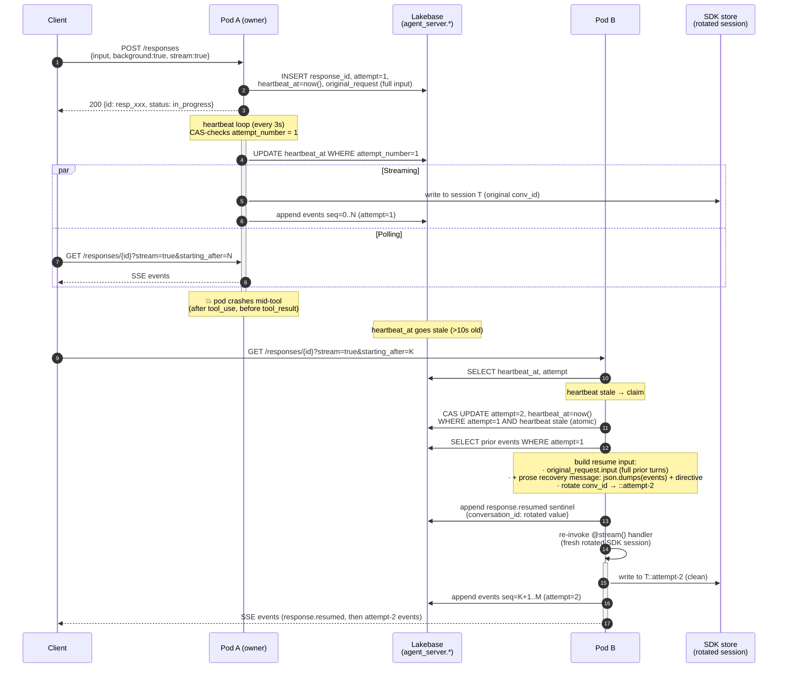
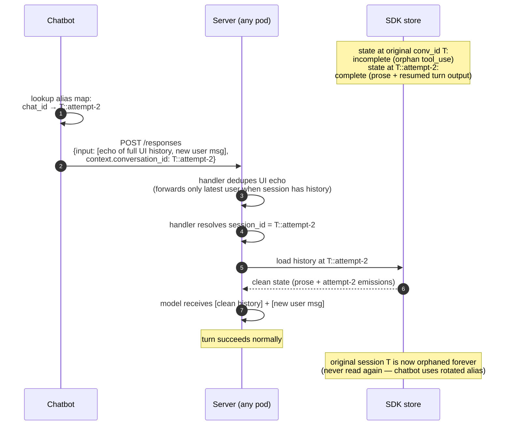
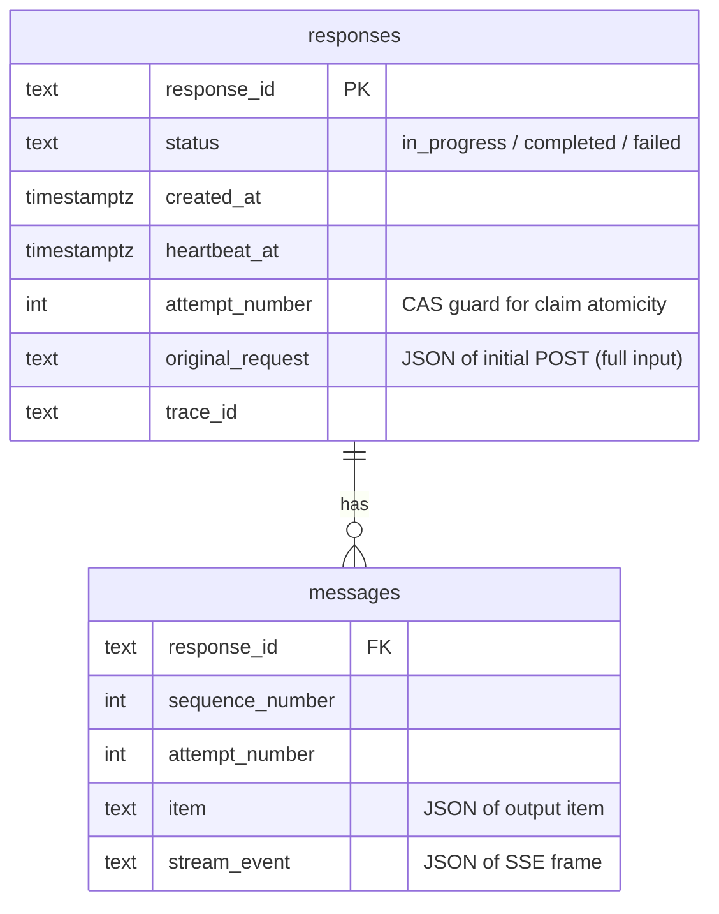
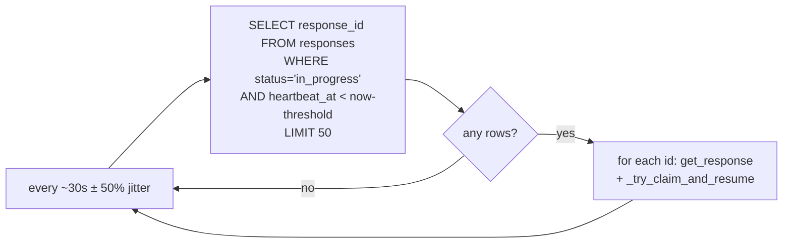
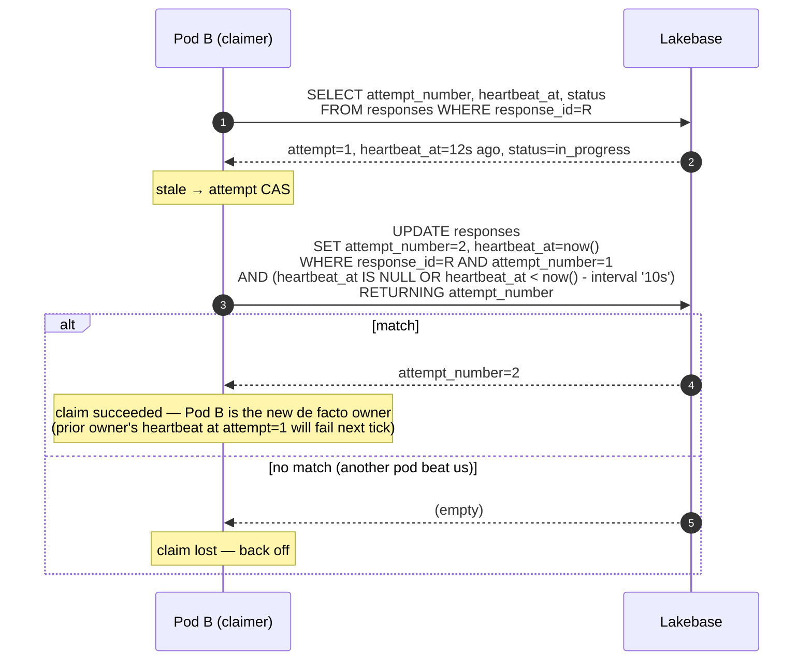

# LongRunningAgentServer

Durable, crash-resumable agent execution for MLflow `ResponsesAgent` handlers.

This document describes:
1. What `LongRunningAgentServer` does and the guarantees it gives callers ([§1](#1-what-this-module-does)).
2. The four customer journeys it covers, with sequence diagrams ([§2](#2-customer-journeys)).
3. The architecture: storage layout, claim mechanism, recovery, and stream resume ([§3](#3-architecture)).
4. Author-side requirements: what changes (and doesn't) when a handler opts into durable mode ([§4](#4-author-side-requirements)).
5. The interface today and how it's expected to evolve when [TaskFlow](https://github.com/databricks-eng/universe/tree/master/experimental/taskflow) lands ([§5](#5-future-direction-taskflow)).

## 1. What this module does

`LongRunningAgentServer` extends MLflow's `AgentServer` for `ResponsesAgent` handlers with three capabilities:

1. **Background execution.** A `POST /responses` request with `background: true` returns a `response_id` immediately; the agent loop runs detached from the HTTP connection. State persists to Lakebase Postgres.
2. **Streaming retrieval.** `GET /responses/{response_id}?stream=true&starting_after=N` replays events past sequence `N` and tails new ones until the run finishes. Reconnects without losing events.
3. **Crash-resumable execution.** If the pod running an agent loop dies, another pod atomically claims the run and finishes the work via **prose recovery**: the new attempt receives a single user message containing `json.dumps(events)` of the crashed attempt's stream-event log plus a directive asking the LLM to figure out what's done vs interrupted and continue. The handler runs on a freshly-rotated SDK session.

Callers see one HTTP surface; the underlying SDK (LangGraph, OpenAI Agents, others) is opaque to the server.

### Guarantees

- **At-most-once durable claim.** Only one pod runs a given response at a time. The handoff uses an atomic CAS on `attempt_number`.
- **Append-only event log.** Every SSE frame is persisted to `agent_server.messages` keyed by `(response_id, attempt_number, sequence_number)`. Clients cursor-resume from `starting_after`.
- **SDK-agnostic recovery.** The resumed attempt receives a flat prose narrative — no provider-specific tool-pair structure, no synthetic tool events, no per-SDK adapter code.
- **Per-template UI-echo dedup.** The bridge does NOT trim echoed history. When the chat client echoes the full prior conversation in `request.input`, the agent handler is responsible for deduping its input against the SDK's session/checkpointer state — typically by forwarding only the latest user message when the session already has prior turns. See the templates in `app-templates/agent-{openai,langgraph}-advanced/` for the canonical 1-2 line shape.
- **Best-effort tool execution.** A tool call interrupted mid-flight may re-run on the resumed attempt. Idempotency is the tool author's responsibility.
- **No agent code changes required.** Templates that subclass `LongRunningAgentServer` keep using `@invoke()` / `@stream()` decorators. All durability lives below the handler boundary.

### Non-goals

- Cross-region failover. Pods are assumed to share one Lakebase.
- Tool-level checkpointing / exactly-once tool execution.
- A workflow DSL. Handlers are ordinary async generators / coroutines.

## 2. Customer journeys

### CUJ 1: Author writes a long-running agent

The author subclasses `LongRunningAgentServer` and registers `@invoke()` / `@stream()` handlers like a regular MLflow agent server. **No durability code in `agent.py`.**

```python
from databricks_ai_bridge.long_running import LongRunningAgentServer
from mlflow.genai.agent_server import invoke, stream

agent_server = LongRunningAgentServer(
    "ResponsesAgent",
    db_instance_name="my-lakebase-instance",
)

@stream()
async def stream_handler(request):
    # ordinary agent code: build messages, call SDK, yield events
    ...

@invoke()
async def invoke_handler(request):
    ...

app = agent_server.app
```

The agent author writes their handler exactly the same way they would for the non-durable `AgentServer`. `LongRunningAgentServer` adds the durable wiring transparently.

### CUJ 2: Pod crashes mid-tool, client polls

A client posts a long-running request, the owning pod dies mid-tool, another pod takes over via prose recovery, and the client gets the final output without restarting.



**What the client observes:** a single SSE stream that may pause briefly during the heartbeat-stale window (~10s by default), then resumes. The `response.resumed` sentinel marks the attempt boundary and carries the rotated `conversation_id` so the chatbot can use the rotated session for subsequent turns.

**What the agent author observes:** their handler is invoked once for the original POST; a second time on resume. The second invocation's `request.input` contains the original input plus a single user message whose body is `[RECOVERY] ... Events: <json.dumps of attempt 1's stream events>`. The model reads it as "the prior attempt crashed, here's the raw event log, figure out what's done and continue."

### CUJ 3: Subsequent turn after a crashed turn

After a successful crash + resume, the next turn from the client lands on a fresh `POST /responses`. The chatbot uses the **rotated** `conversation_id` (captured from the `response.resumed` sentinel) so the handler resolves to the rotated SDK session — which was populated cleanly during attempt 2's prose-recovery run.



Three things make this work without per-SDK repair code:

1. **Server emits the rotated conv_id in `response.resumed`.** The chatbot reads it and updates its `Map<chat_id, conversation_id>` alias.
2. **Per-template UI-echo dedup in the handler.** When the SDK's session/checkpointer already has prior-turn state, the agent forwards only the latest user message (not the full echoed history). This prevents `Runner.run` from sending duplicates of session items + input items to the LLM.
3. **Always-rotate.** The rotated session was the one populated during attempt 2's run. Subsequent turns land on it. The original poisoned session is never read.

### CUJ 4: Multi-pod stale-claim contention

Two pods each see the same response in `in_progress` with a stale heartbeat. Only one wins the CAS.

```mermaid
sequenceDiagram
    autonumber
    participant B as Pod B
    participant DB as Lakebase
    participant C as Pod C

    Note over B,C: both pods see response in_progress, heartbeat stale
    par
        B->>DB: UPDATE responses SET attempt=N+1, heartbeat_at=now()<br/>WHERE response_id=R AND attempt=N AND heartbeat stale
    and
        C->>DB: UPDATE responses SET attempt=N+1, heartbeat_at=now()<br/>WHERE response_id=R AND attempt=N AND heartbeat stale
    end
    Note over DB: only one row matches; the other UPDATE returns 0 rows
    DB-->>B: RETURNING attempt_number=N+1
    DB-->>C: RETURNING (no row)
    Note over B: B wins, builds resume input + spawns handler
    Note over C: C aborts cleanly, returns to its retrieve loop
```

The `claim_stale_response` function (`repository.py`) executes a single `UPDATE … WHERE attempt_number = :current AND ((heartbeat_at IS NULL) OR (heartbeat_at < now() - interval))` with `RETURNING`. Postgres serializes the writes; only the pod whose `current` value was unmodified at commit time gets the `RETURNING` row.

## 3. Architecture

### 3.1 Storage layout

Two tables in the `agent_server` schema:



- `responses.attempt_number` is the CAS guard for claim atomicity. **There is no `owner_pod_id` column** — ownership is implicit. The pod that last successfully heartbeats at the current `attempt_number` is the de facto owner. A heartbeat write at attempt N stops working the moment another pod has CAS-bumped the row to N+1, so the prior owner detects it has lost the claim on its next heartbeat (rowcount=0) and shuts down its heartbeat task.
- `responses.original_request` stores the **full untrimmed input** so the resume path can recover the entire prior-turn history when the rotated SDK session starts empty.
- `messages.attempt_number` tags every event so retrieval can filter to the latest attempt's output (avoiding partial output from a crashed attempt leaking into the final response body).
- Schema migrations are idempotent (`ADD COLUMN IF NOT EXISTS`) so an existing deployment upgrades without downtime.

### 3.2 The four key flows

```mermaid
flowchart TD
    POST["POST /responses<br/>background=true"] --> CR[create_response<br/>store FULL original_request]
    CR --> SPAWN[spawn @stream handler<br/>handler dedupes UI echo against SDK session]
    SPAWN --> HB[heartbeat loop<br/>every 3s]
    SPAWN --> EMIT[append SSE events<br/>to messages table]
    EMIT --> DONE{handler<br/>exits?}
    DONE -- yes --> COMPLETE[update status=completed]
    DONE -- crash --> STALE[heartbeat stops<br/>row goes stale]

    GET["GET /responses/&#123;id&#125;<br/>?stream=true&starting_after=N"] --> CHECK[check heartbeat age]
    CHECK -->|fresh or terminal| READ[read events from messages<br/>where seq > N]
    CHECK -->|stale| CLAIM[CAS claim<br/>attempt += 1]
    CLAIM -->|won| BUILD[build prose recovery message<br/>rotate conv_id<br/>append rotated id to response.resumed]
    CLAIM -->|lost| READ
    BUILD --> SPAWN
    READ --> STREAM[SSE stream to client]

    KILL["POST /_debug/kill_task/&#123;id&#125;<br/>(test-only)"] --> CANCEL[cancel asyncio task<br/>without status update]
    CANCEL --> STALE
```



### 3.3 Resume input construction

When a stale-claim CAS succeeds, the new owner builds the resume input by serializing the prior attempt's stream events as JSON in a single user message:

```mermaid
flowchart LR
    PRIOR[prior attempt's events<br/>from messages table] --> FILTER[filter events by<br/>attempt_number = prior_attempt]
    FILTER --> JSON[json.dumps the events list]
    JSON --> COMPOSE[compose single user message:<br/>'[RECOVERY] previous attempt crashed.<br/>Below is the raw stream-event log...<br/>Inspect the events, figure out what is<br/>already done versus in-progress, and continue.<br/><br/>Events: &lt;json.dumps&gt;']

    ROT[_rotate_conversation_id<br/>::attempt-N suffix] --> SUBMIT
    COMPOSE --> SUBMIT[append to original_request.input<br/>spawn handler with rotated request<br/>emit response.resumed sentinel<br/>with rotated conversation_id]
```

Why JSON-dumped events: the LLM reads them as the authoritative record of what attempt 1 did and decides what to do — re-run an interrupted tool, skip completed ones, summarize from there. No structural carry-forward, no synthetic tool events, no per-SDK pairing rules. The handler doesn't have to know any of this is durable resume — it just sees a recovery user message in `request.input`.

Why rotation: the original SDK session may carry mid-turn state from the crashed attempt (orphan `tool_use`, partial checkpoint) that's hard to repair from outside the SDK. Rotating to `{base}::attempt-N` opens a fresh, empty session for the resumed attempt; the recovery message is the single source of truth for what already happened.

Why the sentinel carries the rotated conv_id: cooperating chat clients capture it (via SSE) and use the rotated session for subsequent turns, so the original orphan-poisoned session is never read again.

### 3.4 Per-template UI-echo dedup (NOT in the bridge)

The bridge does **not** trim UI echo from `request.input`. Echo dedup is the agent handler's responsibility — it owns its SDK session/checkpointer and is the right layer to know what's already persisted vs what's a new turn.

The canonical shape, per template:

**OpenAI Agents SDK** (`agent-openai-advanced/agent_server/utils.py`):
```python
session_items = await session.get_items()
if session_items and len(messages) > 1:
    return [messages[-1]]
return messages
```

**LangGraph** (`agent-langgraph-advanced/agent_server/agent.py`):
```python
state = await agent.aget_state(config)
if state and state.values.get("messages") and input_state["messages"]:
    last_user = next(
        (m for m in reversed(input_state["messages"]) if m.get("role") == "user"),
        None,
    )
    input_state["messages"] = [last_user] if last_user else []
```

Both: when the SDK store already has prior turns, forward only the latest user message and let the SDK prepend its own history. Without dedup, `Runner.run` (OpenAI) or `add_messages` (LangGraph) end up combining session+input → duplicate items → malformed assistant.tool_calls block → 400.

Bridge's role here is just to pass `request.input` through untouched.

### 3.5 Proactive stale-scan loop

In addition to the lazy-on-GET claim path (a stale heartbeat is detected when a client GETs `/responses/{id}`), each pod runs a background **scanner** that periodically queries for in-progress responses with stale heartbeats and tries to claim+resume them. This means crashed responses get recovered even when no client is actively polling.



Each pod jitters its scan interval (`stale_scan_jitter_fraction = 0.5` by default) so multiple pods don't synchronize their queries. CAS-claim semantics ensure only one pod succeeds in claiming any given stale response.

The scanner is a background task spawned in the FastAPI lifespan (alongside `init_db`) and cancelled on shutdown.

### 3.6 Heartbeat and stale threshold

Defaults are tuned for a single Lakebase deployment with low-latency writes.

| Setting | Default | Rationale |
|---|---|---|
| `heartbeat_interval_seconds` | 3.0 | Frequent enough that short pauses (GC, tokio task waits) don't trip stale detection |
| `heartbeat_stale_threshold_seconds` | 10.0 | Three missed heartbeats = unambiguously dead. Validated stale > interval at startup. |
| `task_timeout_seconds` | 3600 | Hard ceiling. After this, a stuck `in_progress` row is force-failed regardless of heartbeat. |
| `poll_interval_seconds` | 1.0 | Stream-retrieve polls the messages table at this rate while waiting for new events. |

The stale threshold also applies as a grace period for newly-created responses that haven't written their first heartbeat yet — protects against an over-eager retrieve hijacking a still-starting handler.

### 3.7 Claim atomicity



Postgres row locking ensures only one of N concurrent UPDATEs matches the `attempt_number = N` predicate, so at most one pod ends up owning a given resume. The bumped `attempt_number` simultaneously revokes the prior owner's heartbeat: their next heartbeat write `WHERE attempt_number = N` returns rowcount=0, telling them they've lost the claim.

## 4. Author-side requirements

### 4.1 What's invisible to authors

| Concern | Where it lives | Author-visible? |
|---|---|---|
| Heartbeat + claim | `LongRunningAgentServer` | No |
| Conversation_id rotation | `LongRunningAgentServer._rotate_conversation_id` | No |
| Prose recovery message construction | `LongRunningAgentServer._build_prose_recovery_message` | No |
| UI-echo dedup | per-template handler (see §3.4) | Yes — 1-2 lines in `agent.py` / `utils.py` |
| Stream resume cursor | `LongRunningAgentServer._stream_retrieve` | No |
| Tool/SDK selection | `agent.py` | Yes (this is the author's actual code) |

The author's `agent.py` is unchanged from a non-durable agent. They construct an `AsyncCheckpointSaver` (LangGraph) or `AsyncDatabricksSession` (OpenAI) and use it normally. Durability fires entirely above the SDK boundary — the SDK adapters themselves contain zero durability code.

### 4.2 Author-visible client cooperation (chat-UI side)

For the always-rotate flow to work cross-turn, a cooperating chat UI needs to:

1. **Capture the rotated `conversation_id` from the SSE `response.resumed` event** when one is emitted during a streaming retrieve.
2. **Use the rotated value as `context.conversation_id` on subsequent requests** for the same chat.

The Express proxy in `e2e-chatbot-app-next/packages/ai-sdk-providers/src/providers-server.ts` does this with an in-memory `Map<chat_id, rotated_conversation_id>`. A multi-pod chatbot deployment would persist this on the chat row.

Without client cooperation: the next turn lands on the original (orphan-poisoned) session and the LLM call fails on the provider's `tool_use ↔ tool_result` pairing rule. The bridge does not silently repair this — the cross-turn property requires the alias.

### 4.3 Settings worth exposing to authors

- `db_instance_name` / `db_autoscaling_endpoint` / `db_project` + `db_branch` — Lakebase connection config.
- `heartbeat_interval_seconds` / `heartbeat_stale_threshold_seconds` — for tuning under heavy load.
- `task_timeout_seconds` — per-attempt ceiling.
- `stale_scan_interval_seconds` / `stale_scan_jitter_fraction` — controls how often (and with how much randomness) each pod scans the DB for stale responses to claim. Defaults to 30s with ±50% jitter.

Everything else is internal.

### 4.4 Test-only debug endpoint: `/_debug/kill_task/{response_id}`

Cancels the in-flight asyncio task that owns the given response on this pod **without** running the `_task_scope` cleanup. The DB row stays `in_progress` with a heartbeat that's about to go stale — exactly the shape a real pod crash leaves. Used in integration tests to simulate a pod crash without restarting the container.

Opt-in via env var: only registered when `LONG_RUNNING_ENABLE_DEBUG_KILL=1`. Never exposed in production.

Returns 404 if no in-flight task for that response exists on this specific pod (the task may already have finished, or it may be running on a different pod).

```bash
curl -sS -X POST -H "Authorization: Bearer $TOKEN" "$APP_URL/_debug/kill_task/$RID"
```

## 5. Future direction: TaskFlow

[TaskFlow](https://sourcegraph.prod.databricks-corp.com/databricks-eng/universe/-/tree/experimental/taskflow) is a Rust-core durable-task engine being built in `experimental/taskflow`. It provides exactly the primitives `LongRunningAgentServer` hand-rolls today (heartbeat, CAS claim, recovery worker, event log with stream resume) — but as a library with WAL-first durability and proactive (not lazy-on-GET) recovery.

When TaskFlow is production-ready, `LongRunningAgentServer` is expected to keep its **HTTP surface and author-visible API unchanged**, swapping only the engine internals.

### Mapping today → TaskFlow

```mermaid
flowchart LR
    subgraph TODAY[LongRunningAgentServer today]
        T1[create_response + asyncio.create_task]
        T2[_heartbeat async CM]
        T3[_try_claim_and_resume CAS]
        T4[_build_prose_recovery_message]
        T5[/responses/&#123;id&#125;?stream=true]
        T6[/_debug/kill_task]
    end

    subgraph TF[TaskFlow]
        F1[Taskflow.start name input user_id]
        F2[built-in executor heartbeat]
        F3[built-in recovery worker + claim_for_recovery]
        F4[TaskHandler.recover ctx previous_events]
        F5[Taskflow.subscribe key last_seq]
        F6[Taskflow.simulate_crash key]
    end

    T1 --> F1
    T2 --> F2
    T3 --> F3
    T4 --> F4
    T5 --> F5
    T6 --> F6
```

### What stays in `LongRunningAgentServer` after the swap

- `POST /responses` / `GET /responses/{id}` HTTP routes (and their schemas).
- The MLflow `@invoke()` / `@stream()` handler convention.
- `_build_prose_recovery_message` — recovery-message construction is handler-policy, not engine-internals; lives in the adapter that bridges MLflow handlers to TaskFlow's `recover()`.
- `_rotate_conversation_id` — same reason.
- Author-visible settings (db config, heartbeat tuning, task timeout, stale-scan tuning).

### What gets deleted

- The hand-rolled heartbeat task and CAS claim CTE — replaced by TaskFlow's executor heartbeat + `claim_for_recovery`.
- The `_try_claim_and_resume` lazy-claim path — TaskFlow's recovery worker handles this proactively and across pods, fixing the documented "claim only fires on GET" limitation.
- The `agent_server.responses` + `agent_server.messages` schema — TaskFlow owns its storage layer.
- The stream-cursor logic in `_stream_retrieve` — `Taskflow.subscribe(key, last_seq)` is the cursor-based stream resume.

### What requires a small TaskFlow API addition

TaskFlow derives idempotency keys as `SHA256(name + canonical_input + user_id)`. The HTTP surface uses a server-generated `resp_{uuid}`. We've requested an `idempotency_key: Option<String>` parameter on `Taskflow.submit()` so we can keep the existing HTTP contract while submitting to TaskFlow. See [`engine.rs:317`](https://sourcegraph.prod.databricks-corp.com/databricks-eng/universe/-/blob/experimental/taskflow/engine/src/engine.rs?L317) for the current `generate_key` call site; the override would slot in there.

### Migration sequencing

1. Add `LongRunningAgentServer(backend="taskflow"|"builtin")` knob, default `"builtin"`. HTTP surface unchanged on either backend.
2. Port `agent-non-conversational` (the simplest template) to `backend="taskflow"`. Run the full crash-resume matrix.
3. Port the advanced templates. **Zero changes to `agent.py`** — the swap is the constructor argument.
4. Flip default to `"taskflow"`. Deprecate `"builtin"`.
5. Delete the heartbeat / claim / repository code. Big delete PR.

The point of the `LongRunningAgentServer` abstraction is exactly this kind of swap: callers should never have to care which engine is underneath.

---

## Quick reference

- **Code:** `src/databricks_ai_bridge/long_running/`
- **Tests:** `tests/databricks_ai_bridge/test_long_running_server.py`, `test_long_running_db.py`
- **Settings:** `LongRunningSettings` in `settings.py`
- **Models:** `Response` and `Message` in `models.py`
- **HTTP routes:** registered in `LongRunningAgentServer._setup_routes`
- **Prose recovery:** `_build_prose_recovery_message` in `server.py`
- **Conversation rotation:** `_rotate_conversation_id` in `server.py`
- **Stale scanner:** `LongRunningAgentServer._stale_response_scanner_loop` in `server.py`
- **UI-echo dedup:** in agent code, see `app-templates/agent-{openai,langgraph}-advanced/`
